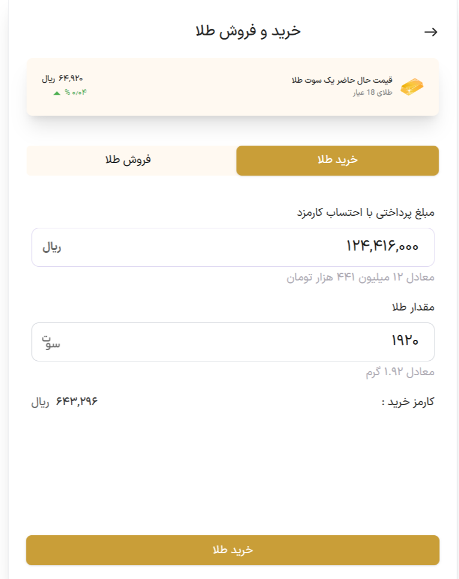

# 🟡 Shemsh UI Challenge – Front-End Test

This is a front-end coding challenge for a gold-selling company. The goal is to build a responsive, pixel-perfect UI based on a Figma design, using **Next.js 14**, **Tailwind CSS v3**, and custom design assets like fonts and colors.

---
## 🌐 Live Demo

[View Project Live](https://shemsh-challlenge.vercel.app/)

--- 

## 🚀 Tech Stack


- ⚛️ [Next.js 14](https://nextjs.org/)
- 🌬️ [Tailwind CSS 3](https://tailwindcss.com/)
- 📝 [React Hook Form](https://www.react-hook-form.com/)
- 💠 [React Icons](https://react-icons.github.io/react-icons/)
- 🎨 Custom Fonts (IranSansX)
- 🖌️ Color palette extracted from [Figma Design](https://www.figma.com/design/4WLpksw7ekGeWm5PL34GPA/front-ent-test?node-id=0-1&p=f&t=aoIzjAMM6CZRE2Ez-0)
- 🧱 Component-based architecture


---

## 📁 Folder Structure

├── app/ ├── components/ ├── public/ │ └── fonts/ ├── styles/ │ └── globals.css ├── tailwind.config.js ├── postcss.config.js ├── package.json

---

## 📸 Preview



---

## 🛠️ Getting Started

Clone the repository and install dependencies:

```bash
git clone [https://github.com/mary9978/shemsh-challenge]
npm i
npm run dev
